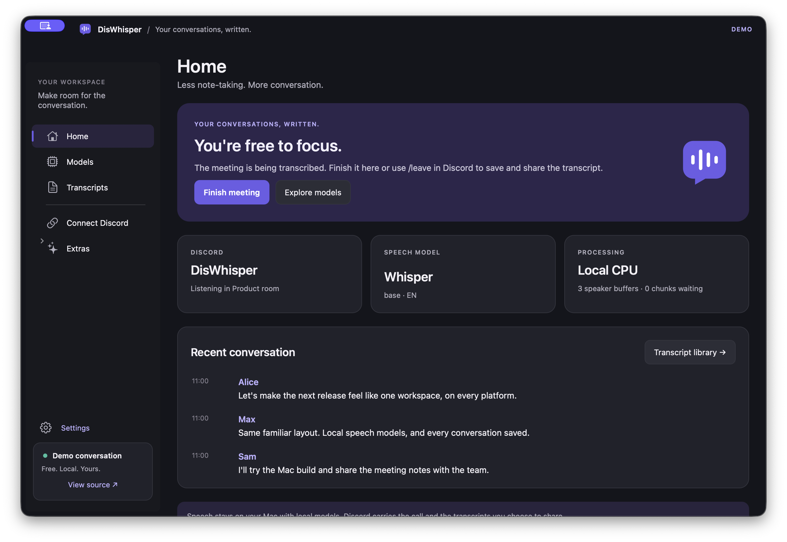

<p align="center">
  
</p>

<p align="center">
  <a href="https://github.com/MaxJafar/DisWhisper/releases/latest/download/DisWhisper-0.2.1-windows-x64-setup.exe"><b>Download for Windows</b></a>
  · <a href="https://github.com/MaxJafar/DisWhisper/releases/latest"><b>Download for macOS</b></a>
  · <a href="docs/windows-quickstart.md">Windows setup</a>
  · <a href="docs/macos-quickstart.md">Mac setup</a>
  · <a href="CONTRIBUTING.md">Contribute</a>
  · <a href="LICENSE">0BSD license</a>
</p>

# DisWhisper — Discord voice transcription for Windows and macOS

**DisWhisper is a free, open-source Discord transcription app with native Windows and macOS interfaces.** Transcribe voice calls locally with Whisper, SenseVoice, or Vosk, follow each speaker, and save searchable meeting transcripts. Bring your own Discord bot and download a speech model in the app.

No subscription, account with us, or cloud API key is required for local transcription. Your computer runs the speech model. Discord still carries the call and any transcripts the bot posts.

## Features

- **Native Windows app.** Mica, light and dark themes, responsive navigation, keyboard shortcuts, restrained motion, and a tray icon. Closing the window keeps the bot running.
- **Native macOS app.** Swift and AppKit, the same workspace and violet visual language, a translucent split-view sidebar, light/dark themes, ⌘1–4 navigation, and a menu-bar companion. Closing the window keeps the bot running.
- **Guided Discord setup.** Check your own bot, invite it with the required permissions, pick a server and language, and connect from Home.
- **Download models in the app.** Whisper from tiny to large-v3-turbo, SenseVoice, and compact Vosk models for English, Russian, German, and Turkish. Switch providers without editing source code.
- **Live, attributed transcripts.** Per-speaker audio buffering, silence filtering, and Discord message grouping.
- **A dedicated channel.** The bot creates `#live-transcript` when invited, streams recognized speech there, and shares a Markdown export when the meeting ends.
- **A transcript library.** Search, preview, copy, and open saved meeting files.
- **Optional AI meeting summaries.** Use Ollama locally, or bring a Groq/OpenAI key for cloud transcription and summaries.

## App preview

<p align="center">
  
</p>

<p align="center"><sub>The native macOS companion, captured with its built-in demo conversation. Windows uses the same workspace and visual language.</sub></p>

## Download for Windows and macOS

Both native apps share the same Python core, pages, controls, and meeting workflow.

| App | Native UI | Download | Build command |
|---|---|---|---|
| Windows x64 | WinUI 3 / .NET 8 | [Installer](https://github.com/MaxJafar/DisWhisper/releases/download/v0.2.1/DisWhisper-0.2.1-windows-x64-setup.exe) · [Portable ZIP](https://github.com/MaxJafar/DisWhisper/releases/download/v0.2.1/DisWhisper-0.2.1-windows-x64.zip) | `.\scripts\build_windows.ps1` |
| Mac, Apple Silicon | Swift / AppKit | [DMG installer](https://github.com/MaxJafar/DisWhisper/releases/download/v0.2.1/DisWhisper-0.2.1-macos-arm64.dmg) · [Portable ZIP](https://github.com/MaxJafar/DisWhisper/releases/download/v0.2.1/DisWhisper-0.2.1-macos-arm64.zip) | `./scripts/build_macos.sh` |
| Mac, Intel | Swift / AppKit | [DMG installer](https://github.com/MaxJafar/DisWhisper/releases/download/v0.2.1/DisWhisper-0.2.1-macos-x86_64.dmg) · [Portable ZIP](https://github.com/MaxJafar/DisWhisper/releases/download/v0.2.1/DisWhisper-0.2.1-macos-x86_64.zip) | `./scripts/build_macos.sh` |

Run the Windows installer, or open the Mac disk image and drag **DisWhisper.app** onto **Applications**. Both apps include their backend runtime; Python, .NET, and Homebrew are not separate installation requirements. Speech models download in the app. Mac packages target macOS 13+ and are built separately for Apple Silicon and Intel.

See the [Windows quickstart](docs/windows-quickstart.md) or [Mac quickstart](docs/macos-quickstart.md) for installation and first launch. To build from source, use the matching platform and follow the [contributor guide](CONTRIBUTING.md). The Python core can also run on its own.

## Start your first meeting

1. [Download the app for your platform](https://github.com/MaxJafar/DisWhisper/releases/latest). On Windows, run the installer and open DisWhisper from Start. On macOS, open the matching DMG, drag **DisWhisper.app** to **Applications**, and open it. Portable ZIPs are also available; extract the whole Windows folder.
2. Open **Connect Discord**. Create an application and bot in the [Discord Developer Portal](https://discord.com/developers/applications), then paste the bot token into the app's password field. Never share it.
3. **Check connection**, use **Invite bot**, and check again after adding it to your server. Select the server and speech language, then save.
4. In **Models**, download **Whisper Base** to start, then select **Use model**. Larger Whisper models can improve recognition at the cost of download size, memory, and processing time.
5. On **Home**, connect the bot. Join a Discord voice channel and use **`/join`**. Use **`/leave`** or **Finish meeting** in the app to save and share the completed transcript.

The bot does not automatically listen when invited. Let participants know before starting transcription. You can disable completed-transcript sharing, automatic channel creation, local exports, or automatic connection in Settings.

**Windows requirements:** Windows 10 (2004+) or Windows 11, x64. CPU inference is supported. NVIDIA acceleration needs compatible CUDA 12 cuBLAS and cuDNN 9 libraries; the app falls back to CPU when those libraries are unavailable. You can point Settings → Advanced to an existing NVIDIA runtime folder. GPU libraries are not bundled.

**macOS requirements:** macOS 13+ and a package built for your Mac's architecture. Building from source requires Xcode 15+ and uv. Local speech processing uses the CPU; cloud providers and Ollama notes remain optional.

Both apps need an internet connection for Discord and initial model downloads, plus permission to add/manage a bot in your server. Windows releases are unsigned; Mac builds use ad-hoc signatures and are not notarized. The quickstarts explain first-launch security prompts. Every installer and ZIP has a SHA-256 checksum on the release page.

## Choose your speech model

| Provider | Best starting point | Language support | Processing |
|---|---|---|---|
| Whisper | Base for general use; large-v3-turbo for a capable PC | Multilingual, including Russian | Local CPU or NVIDIA GPU |
| SenseVoice | Small int8 model | Chinese, English, Japanese, Korean, Cantonese | Local CPU |
| Vosk | Small model for your language | Separate English, Russian, German, Turkish models | Local CPU |
| Groq / OpenAI | Optional provider with your API key | Provider/model dependent | Cloud |

Model accuracy and speed depend on your hardware, microphone quality, language, and conversation. Vosk uses its model's fixed language. Downloaded models and dependencies keep their upstream licenses.

For local AI notes, install [Ollama](https://ollama.com/), start it, and download a language model from **Models → Local meeting notes**. Ollama is an optional separate program. Groq/OpenAI may charge for cloud usage.

## Discord commands

| Command | What it does |
|---|---|
| `/join` | Listen in the caller's voice channel and start a transcript |
| `/leave` | Finish, flush remaining audio, and share the completed file |
| `/export` | Share a snapshot of the current meeting |
| `/status` | Show the engine, voice connection, and queue |
| `/engine` | Switch speech provider |
| `/summarize` | Generate optional meeting notes |

One process transcribes one voice channel at a time. Meeting controls require the same voice channel or server-management permission. If everyone leaves, the bot finishes after 60 seconds by default. Command registration is immediate for a configured server; global Discord commands can take time to appear.

The invite asks for **Manage Channels, View Channel, Send Messages, Embed Links, Attach Files, Read Message History, and Connect**. Administrator and privileged gateway intents are not required. Existing channel restrictions still apply; the bot never silently redirects transcripts into another channel if setup fails.

## Where your data goes

The desktop app stores configuration, downloaded models, logs, and transcripts under:

```text
%LOCALAPPDATA%\DisWhisper\Data
# macOS:
~/Library/Application Support/DisWhisper/Data
```

- Speech chunks are buffered in memory; the app does not save raw call recordings.
- Saved transcripts are Markdown files in `Data\transcripts`. Local files survive a Discord upload failure.
- Newly saved Discord tokens and API keys use Windows DPAPI for the current Windows account. Existing plain-text CLI `.env` files remain your responsibility.
- On macOS, newly saved credentials use the login Keychain. `config.json` contains opaque references, and replaced/failed saves clean up their Keychain entries.
- The local HTTP/WebSocket service binds to loopback at `127.0.0.1:8765`, rejects cross-origin requests and unexpected Host headers, and never returns secret values.
- Hugging Face downloads fetch public model files; its optional telemetry and implicit account-token use are disabled in the packaged app.
- Local speech inference works without a cloud STT service. Discord receives messages and files posted by your bot. Selecting a cloud speech provider sends audio there; selecting cloud notes sends transcript text there.

There is no DisWhisper hosted backend or analytics service.

## Run from source

Use Python 3.12 for the tested development environment:

```powershell
git clone https://github.com/MaxJafar/DisWhisper.git
cd DisWhisper
python -m venv .venv
.\.venv\Scripts\python -m pip install -e ".[dev]"
# Native UI development requires the .NET 8 SDK:
.\scripts\setup_companion.ps1 -CreateDesktopShortcut
.\scripts\run_companion.bat
```

On macOS with Xcode 15+ and uv:

```bash
./scripts/setup_macos.sh
./scripts/run_macos.sh
# Portable AppKit app + embedded Python backend:
./scripts/build_macos.sh
```

The companion manages the backend and uses its own app-data configuration. For a separate CLI bot, copy `.env.example` to `.env`, set your token, and run:

```powershell
.\.venv\Scripts\python -m diswhisper.main
```

CLI configuration priority is environment/`.env`, then `config.json`, then defaults. JSON can be based on `config.json.example`. Keep private configuration and meeting files out of commits.

See [CONTRIBUTING.md](CONTRIBUTING.md) for release builds, [the API reference](docs/api.md) for companion integrations, and [the architecture](docs/architecture.md) for both native companions.

## License and community

DisWhisper source and original branding are released under **[Zero-Clause BSD (0BSD)](LICENSE)**. You may use, copy, modify, and distribute them for any purpose, with or without a fee, without an attribution requirement. The license includes the usual warranty disclaimer.

Dependencies, fonts supplied by your OS, and downloaded models retain their own licenses. The Windows and macOS portable applications include GPL audio codecs and are distributed as combined works under GPL-3.0-or-later. Windows releases and the Mac build script provide corresponding third-party source archives; project source remains available under 0BSD. See [THIRD_PARTY_NOTICES.md](THIRD_PARTY_NOTICES.md).

Bug reports, accessibility feedback, and contributions are welcome. Use the [issue tracker](https://github.com/MaxJafar/DisWhisper/issues) for product bugs and [SECURITY.md](SECURITY.md) for private security reports.

DisWhisper is an independent project and is not affiliated with Discord, OpenAI, Alibaba, or the other providers.
